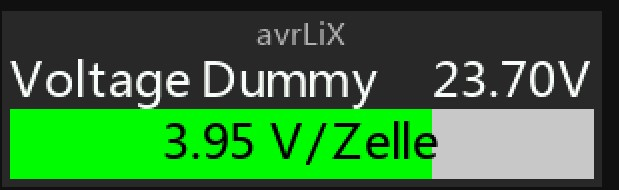
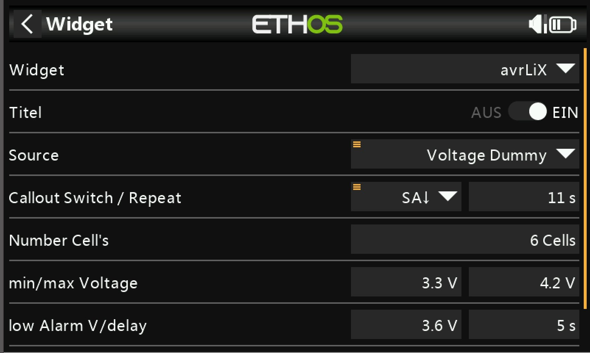
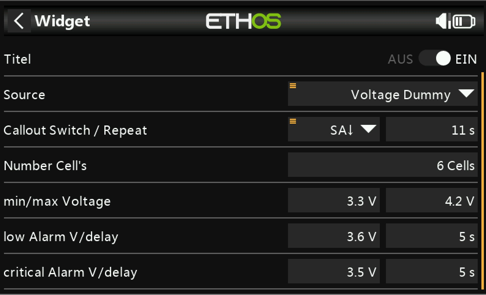

# avgLiX
is Lua Script for Ethos, that creates a widget to calculate and show the average Voltage per Cell of a battery pack from a single voltage source.

## Functions
* Shows the voltage of the battery pack and the average cell voltage.
* Shows a bargraph for the average voltage between definable minimum and maximum voltage.
* Displays the average voltage by a switch and definable repeat.
* Alerts for low and critical voltage with a callout and a definable delay (to prevent alerts during short bursts with high current).
* Bargraph changes color (green, yellow, red) according to low and critical voltage thresholds.

## Configuration

## Installation

1. Copy the folder *\avrLiX* to the folder *\scripts* of your sd card
2. Copy the files in the folder *\audio* to the folder *\audio* of your sd card

## Testing
Tested with device **X20S** and Ethos **1.4.8**

The files *voltageSourceDummy.lua* and *volSourDummy_reg.lua* are lua-sources, that can be used to test in the simulator.
